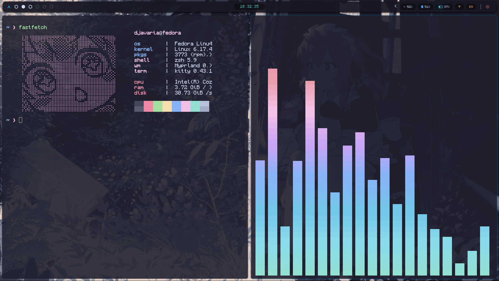
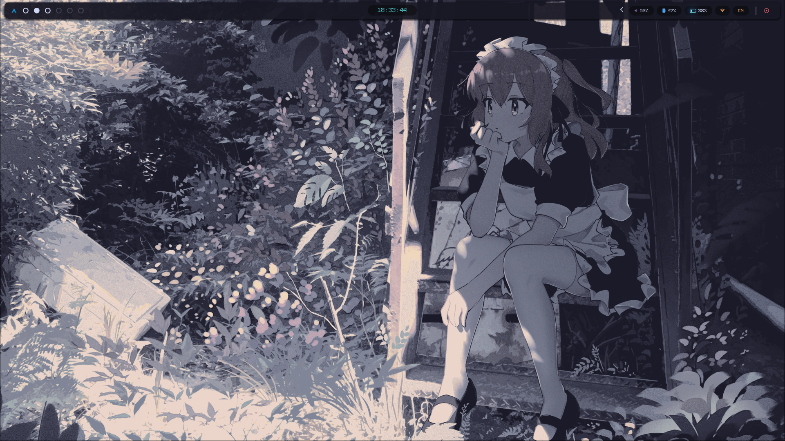

# Dotfiles

My personal Linux configuration files (dotfiles), focused on productivity, customization, and a keyboard-driven workflow(Somehow Works on my machine lol).




## 🛠 Included
- Window manager configuration
- Terminal configuration
- Shell setup
- Widgets and system information
- Wallpapers

## 📁 Structure
Each folder corresponds to a specific tool or component used in my setup.

## 🚀 Usage
These dotfiles are tailored for my personal workflow.  
If you want to explore them:

```bash
git clone https://github.com/daksh8138/dotfiles.git
